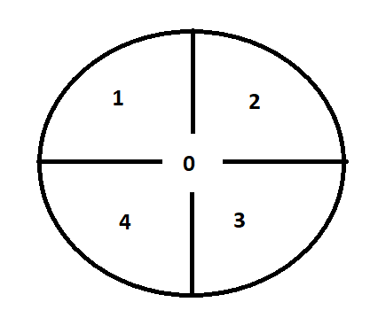

# Pepper.py
Main pepper robot class which initializes all the other classes when the pepper object is made in the main. 

# Motion.py
This class has many different definitions.
These definitions are all different types of movements, 
such as "Stand up", "Go to sleep", "Wave", "move elbow" and 
many more types of movements. You can then recall these
movements in the main. You can also adjust the joints of the
robot. For example, you have the x, y, and z and these are all
directions that an arm or an elbow can move to. You can also 
make your own movements.


# Speech.py
With this class you can make the robot speak. 
There are also different definitions in this class. 
With these definitions you can adjust the voice settings. 
For example, the volume, language, pitch, and speed. 
Also this class has a piece of code that will make your robot say "Hello" in different languages randomly.

# Autonomous_ability.py
With this class we enable the autonomous life functions of the robot. We also are able to control callback. 

# Exploration.py
## Class and methods
 This class makes use of the Exploration API.
 These definitions are the used to do the following but not limited: 
 Scanning and exploring the environment to make the map, 
 save the map created by the exploring, stop/interrupt the exploration, 
 load a selected map, start and stop using the map.
 There is also a method that's used to generate random coordinates for the created map.

___ 
## Robot map coordinates
For quick understanding of how the robot looks at the coordinates 
there is a compass created with the location of the coordinates, and the codes related to it.
Disclaimer : This is done with a 1-meter radius.

``` python
  # Coordinates of location 0 (Center)
  navigate_to_in_map(0.0, 0.0, 0)  
  # Coordinates of location 1 (top-left)
  navigate_to_in_map(1.0, 1.0, 0)       
  # Coordinates of location 2 (top-right)
  navigate_to_in_map(1.0, -1.0, 0)      
  # Coordinates of location 3 (bottom right)
  navigate_to_in_map(-1.0, -1.0, 0)    
  # Coordinates of location 4 (bottom left)
  navigate_to_in_Map(-1.0, 1.0, 0)  
     
```

